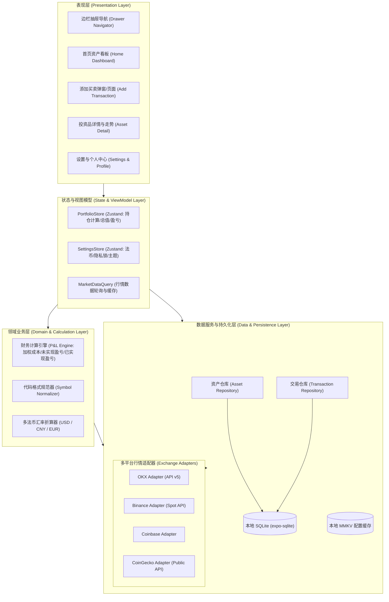
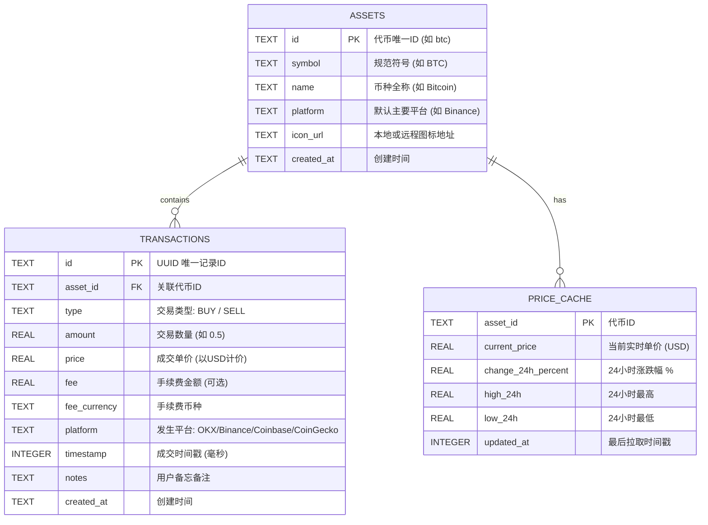
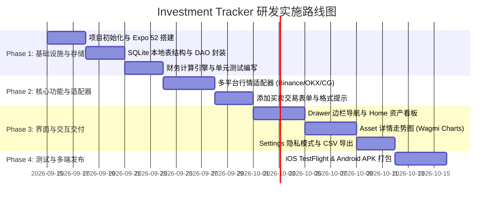

# Investment Tracker (投资追踪器) 系统架构设计文档 (SAD)

## 1. 系统概述与设计目标

### 1.1 项目背景与愿景
**Investment Tracker** 是一款面向个人投资者的轻量级、跨平台（iOS & Android）投资状况追踪应用。
- **定位**：高信噪比、极简、即开即用的投资盈亏分析与资产看板。
- **演进路线**：
  - **初期（Phase 1 - 当前）**：聚焦于**加密货币（Cryptocurrency）**投资跟踪，支持手动/快捷录入买卖交易，打通主流平台（OKX、Binance、CoinGecko、Coinbase）行情，计算加权持仓成本、实时市值与盈亏走势。
  - **后续（Phase 2）**：平滑拓展至**股票（美股、港股、A股）**资产，增加行情告警与高级报表。

### 1.2 核心架构原则
1. **Local-First & 隐私优先（Privacy First）**：
   - 用户的买卖流水、持仓量、成本等核心财务隐私**全部保存在用户手机本地 SQLite**，无需强制注册后端云服务，杜绝资产泄露风险。
2. **极简边栏架构（Drawer-first Navigation）**：
   - 针对前期仅有「Home 看板」与「Settings/Profile」的双核心模块，采用左侧滑动边栏抽屉替代拥挤的底部 Tab 栏，释放全屏纵向空间。
3. **高扩展性插件化适配器（Pluggable Exchange Adapters）**：
   - 将 OKX、Binance、Coinbase、CoinGecko 的 API 查询与代码格式统一抽象为标准接口，未来接入新交易所或股票数据源（如 Yahoo Finance, AlphaVantage）零重构。
4. **极致流畅与低功耗（60/120 FPS & Battery Friendly）**：
   - 图表采用 GPU 加速的 Skia 渲染引擎，行情抓取支持智能节流轮询与按需拉取，避免后台电量消耗。

---

## 2. 技术选型与技术栈评估 (Tech Stack)

综合开发效率、双端渲染一致性及加密资产图表生态，选用 **React Native + Expo (TypeScript)** 作为基石，同时对比如下：

| 模块 | 选型方案 | 备选方案 | 选型理由 |
| :--- | :--- | :--- | :--- |
| **应用框架** | **React Native (Expo SDK 52+)** | Flutter | Expo 最新架构支持预编译、热更新，Web3/Crypto 开源生态及多格式解析库极度丰富。 |
| **编程语言** | **TypeScript 5.x (Strict)** | Dart | 严格类型检查，确保高精度的财务计算与 API 响应模型安全。 |
| **导航系统** | **React Navigation 7 (Drawer + Stack)** | Expo Router | 提供底层最原生的手势抽屉驱动与页面栈管理，支持 120Hz 丝滑拖拽。 |
| **本地数据库** | **expo-sqlite (搭配 Kysely / Drizzle ORM)** | WatermelonDB / Realm | 原生 SQLite 性能卓越，跨平台支持好，便于执行复杂财务加权汇总 SQL。 |
| **键值/状态持久化**| **react-native-mmkv** | AsyncStorage | 微信/腾讯开源的高性能跨进程缓存，性能是 AsyncStorage 的 30+ 倍，毫秒级读取。 |
| **图表绘制** | **react-native-wagmi-charts + Skia** | Victory Native | 专为金融/加密走势图优化，内置高精手势游标（Scrubbing）、平滑触觉反馈与梯度阴影。 |
| **样式与系统** | **NativeWind (Tailwind CSS v4)** | StyleSheet / Tamagui | 保留 Web 设计语言一致性，快速实现暗黑玻璃质感、圆角与响应式间隙。 |
| **敏感信息存储** | **expo-secure-store** | Keychain / Keystore | 硬件级加密存储 API Key、Face ID 凭证与隐私锁状态。 |

---

## 3. 总体架构与分层设计 (Architecture Layers)

系统采用典型的 **整洁架构（Clean Architecture）** 与分层模型，自上而下分为四层：



### 3.1 表现层 (Presentation Layer)
- **Drawer Navigator**：根控制器，负责 `Home` 与 `Settings/Profile` 的手势呼出与转场。
- **Screen Components**：
  - `HomeScreen`：顶部总资产卡片（集成 Sparkline 微图）、资产列表（支持下拉刷新、资产排序、点击进入详情）。
  - `AddTransactionModal`：交易方向切换（买/卖）、平台快捷选择芯片、代码智能提示、价格抓取与实时总额推导。
  - `AssetDetailScreen`：持有量与盈亏指标、Wagmi Charts 动态手势走势图（`24H/1W/1M/1Y/ALL`）、交易流水明细。
  - `SettingsScreen`：货币切换、隐私模式（Hide Balance）、导出 CSV、生物识别开关。

### 3.2 状态管理与视图模型层 (State Layer)
- **Zustand** 管理客户端瞬时与全局状态：
  - `usePortfolioStore`：管理当前持仓快照、总收益、24h 涨跌数据。
  - `useSettingsStore`：管理基准法币（默认 USD）、防偷窥状态（Privacy Mode）。
- **TanStack Query (React Query)**：
  - 管理异步外部行情请求的缓存、后台自动刷新、失败重试与去抖动（Debouncing）。

### 3.3 领域与财务计算层 (Domain Layer)
- **P&L Engine**：纯函数式、零外部依赖的数学计算核心，负责持仓成本归集、未实现/已实现盈亏与收益率计算。
- **Symbol Normalizer**：将各交易所不同的代币格式（如 `BTC-USDT` vs `BTCUSDT` vs `bitcoin`）统一映射为规范代币对象。

### 3.4 数据适配与持久化层 (Data Layer)
- **Exchange Adapter Pattern**：统一的 `IExchangeAdapter` 接口，隔离各平台 API 差异。
- **Local SQLite**：承载所有历史交易流水的持久化存储，保障无网环境下的秒开与离线浏览。

---

## 4. 数据库实体与数据模型 (Database Schema)

应用本地采用 SQLite 存储，支持完整的 ACID 事务。核心数据表结构如下：



### 4.1 SQL DDL 定义

```sql
-- 1. 资产表 (Assets)
CREATE TABLE IF NOT EXISTS assets (
    id TEXT PRIMARY KEY,
    symbol TEXT NOT NULL,
    name TEXT NOT NULL,
    platform TEXT NOT NULL DEFAULT 'Binance',
    icon_url TEXT,
    created_at INTEGER NOT NULL
);

-- 2. 买卖交易明细表 (Transactions)
CREATE TABLE IF NOT EXISTS transactions (
    id TEXT PRIMARY KEY,
    asset_id TEXT NOT NULL,
    type TEXT NOT NULL CHECK(type IN ('BUY', 'SELL')),
    amount REAL NOT NULL CHECK(amount > 0),
    price REAL NOT NULL CHECK(price >= 0),
    fee REAL DEFAULT 0,
    fee_currency TEXT DEFAULT 'USD',
    platform TEXT NOT NULL,
    timestamp INTEGER NOT NULL,
    notes TEXT,
    created_at INTEGER NOT NULL,
    FOREIGN KEY(asset_id) REFERENCES assets(id) ON DELETE CASCADE
);

CREATE INDEX IF NOT EXISTS idx_tx_asset_timestamp ON transactions(asset_id, timestamp DESC);

-- 3. 价格与行情缓存表 (Price Cache)
CREATE TABLE IF NOT EXISTS price_cache (
    asset_id TEXT PRIMARY KEY,
    current_price REAL NOT NULL,
    change_24h_percent REAL DEFAULT 0,
    high_24h REAL,
    low_24h REAL,
    sparkline_json TEXT, -- JSON 格式历史走势点阵
    updated_at INTEGER NOT NULL,
    FOREIGN KEY(asset_id) REFERENCES assets(id) ON DELETE CASCADE
);
```

---

## 5. 财务与盈亏计算引擎规范 (Financial Calculation Engine)

财务计算要求精确、合规且符合投资者习惯。本引擎默认采用 **移动加权平均成本法（Weighted Average Cost Basis）**：

### 5.1 核心算法数学模型

1. **当前净持仓量 ($Q_{\text{holding}}$)**：
   $$Q_{\text{holding}} = \sum Q_{\text{buy}} - \sum Q_{\text{sell}}$$
   *(注：若 $Q_{\text{holding}} < 0$，系统进行数据校验报错阻断)*

2. **加权持仓成本均价 ($P_{\text{avg}}$)**：
   每次执行买入交易 $(Q_{\text{new}}, P_{\text{new}})$ 时更新：
   $$P_{\text{avg\_new}} = \frac{(Q_{\text{current}} \times P_{\text{avg\_old}}) + (Q_{\text{new}} \times P_{\text{new}})}{Q_{\text{current}} + Q_{\text{new}}}$$
   *(注：卖出交易仅减少持币量 $Q_{\text{holding}}$，不改变持仓均价 $P_{\text{avg}}$)*

3. **单币种当前市值 ($V_{\text{market}}$)**：
   $$V_{\text{market}} = Q_{\text{holding}} \times P_{\text{current}}$$

4. **未实现盈亏与收益率 (Unrealized P&L)**：
   $$\text{PnL}_{\text{unrealized}} = (P_{\text{current}} - P_{\text{avg}}) \times Q_{\text{holding}}$$
   $$\text{Return Rate \%} = \frac{P_{\text{current}} - P_{\text{avg}}}{P_{\text{avg}}} \times 100\%$$

5. **已实现盈亏 (Realized P&L，卖出时结转)**：
   对于单次卖出 $(Q_{\text{sell}}, P_{\text{sell}})$：
   $$\text{PnL}_{\text{realized}} = (P_{\text{sell}} - P_{\text{avg}}) \times Q_{\text{sell}} - \text{Fee}$$

6. **投资组合总资产 ($V_{\text{portfolio}}$) 与总盈亏**：
   $$V_{\text{portfolio}} = \sum_{i=1}^{N} V_{\text{market}, i}$$
   $$\text{Portfolio Total PnL} = \sum_{i=1}^{N} \text{PnL}_{\text{unrealized}, i} + \sum \text{PnL}_{\text{realized}}$$

---

## 6. 多平台数据源适配器架构 (Exchange Adapters)

为了抹平 OKX、Binance、Coinbase、CoinGecko 各家 API 格式差异，定义抽象接口：

### 6.1 适配器接口定义 (TypeScript)

```typescript
export interface TickerData {
  symbol: string;
  priceUSD: number;
  change24hPercent: number;
  high24h?: number;
  low24h?: number;
  lastUpdated: number;
}

export interface HistoricalPoint {
  timestamp: number;
  price: number;
}

export interface IExchangeAdapter {
  readonly platformName: 'OKX' | 'Binance' | 'CoinGecko' | 'Coinbase';
  
  // 校验并格式化用户输入的代币代码
  formatSymbol(inputSymbol: string): string;
  
  // 代码建议提示语
  getFormatHint(): string;
  
  // 获取单个代币最新现价
  fetchTicker(symbol: string): Promise<TickerData>;
  
  // 获取分时历史走势点 (1D, 1W, 1M, 1Y, ALL)
  fetchHistoricalChart(symbol: string, timeframe: '24H' | '1W' | '1M' | '1Y' | 'ALL'): Promise<HistoricalPoint[]>;
}
```

### 6.2 各平台格式与 API 对照表

| 平台 (Platform) | 规范格式 | 格式示例 | 免费公共行情端点 (Public REST Endpoint) |
| :--- | :--- | :--- | :--- |
| **Binance** | `[SYMBOL][QUOTE]` | `BTCUSDT` | `GET https://api.binance.com/api/v3/ticker/24hr?symbol=BTCUSDT` |
| **OKX** | `[SYMBOL]-[QUOTE]` | `BTC-USDT` | `GET https://www.okx.com/api/v5/market/ticker?instId=BTC-USDT` |
| **Coinbase** | `[SYMBOL]-[QUOTE]` | `BTC-USD` | `GET https://api.exchange.coinbase.com/products/BTC-USD/ticker` |
| **CoinGecko** | `[id]` (全小写名称) | `bitcoin` | `GET https://api.coingecko.com/api/v3/simple/price?ids=bitcoin&vs_currencies=usd&include_24hr_change=true` |

### 6.3 容灾降级与缓存策略 (Fallback & Caching)
1. **优先直连所选平台**：用户指定从 Binance 购买时，优先调用 Binance 行情接口。
2. **失效自动降级**：若交易所因区域限制或网络阻断返回 403/超时，系统自动降级使用 **CoinGecko** 聚合行情作为备用数据源，确保不黑屏、不断流。
3. **节流刷新**：前台活跃时每 15 秒轮询一次，退到后台自动暂停轮询；利用 ETag 或本地 60 秒有效期缓存，避免频繁触发 API 频率限制（Rate Limit）。

---

## 7. 安全、隐私与备份架构 (Security & Backup)

1. **零数据上云（Zero Cloud Telemetry）**：
   - 所有记账流水、账户规模等高度敏感数据均保留在手机沙盒 SQLite 中。
2. **防窥与生物安全认证**：
   - 启用 `expo-local-authentication`，支持 Face ID、Touch ID 或系统锁屏密码。
   - 切换至手机多任务卡片视图时，自动模糊界面内容（App Switcher Blurring），防止被旁人截屏窥视。
3. **数据导入与导出（Data Portability）**：
   - **导出**：一键生成带时间戳的标准 `.csv` 文件或加密 `.json` 备份。
   - **导入**：支持解析标准 CSV 格式重新导入，方便用户换机或多设备迁移。

---

## 8. 代码目录结构工程规范 (Project Layout)

```
investment-tracker/
├── design/                        # UI 设计图、设计规范与 HTML 原型
│   ├── images/                    # 高保真效果图
│   ├── UI_DESIGN_SPEC.md          # 视觉规范
│   └── index.html                 # 动态交互原型
├── document/                      # 架构设计与技术文档
│   ├── ARCHITECTURE.md            # 本系统架构设计说明书
│   └── README.md                  # 文档索引
└── src/                           # 客户端核心源代码 (React Native/Expo)
    ├── app/                       # 路由与导航系统
    │   ├── _layout.tsx            # 根布局 (Drawer Navigator + 边栏组件)
    │   ├── index.tsx              # 首页看板 (Home Portfolio)
    │   ├── settings.tsx           # 设置与个人资料 (Settings & Profile)
    │   ├── add-transaction.tsx    # 添加交易 Modal
    │   └── asset/[id].tsx         # 投资品详情动态路由
    ├── components/                # 通用 UI 组件
    │   ├── common/                # Button, Input, Switch, Card, Badge
    │   ├── charts/                # Skia/Wagmi 价格趋势图与 Sparkline
    │   └── drawer/                # 侧边抽屉自定义内容组件
    ├── features/                  # 业务功能模块
    │   ├── portfolio/             # 资产统计卡片、持仓列表组件与 Hooks
    │   ├── transactions/          # 买卖表单、交易列表项、校验逻辑
    │   └── settings/              # 币种选择器、隐私锁开关逻辑
    ├── domain/                    # 核心领域业务逻辑
    │   ├── calculations/          # 盈亏、均价、市值纯函数 (严格单元测试)
    │   └── normalizers/           # 代币符号标准化转换
    ├── services/                  # 数据服务与外部 API
    │   ├── adapters/              # OKX, Binance, Coinbase, CoinGecko 适配器
    │   └── exchangeService.ts     # 适配器调度中心与容灾 fallback
    ├── database/                  # 本地数据持久化
    │   ├── schema.ts              # SQLite 表结构与迁移
    │   ├── db.ts                  # 数据库连接单例
    │   └── repositories/          # 资产仓储与交易流水仓储
    ├── store/                     # 全局状态管理 (Zustand)
    │   ├── usePortfolioStore.ts
    │   └── useSettingsStore.ts
    └── utils/                     # 通用工具 (日期格式化、货币格式化)
```

---

## 9. 实施路线与里程碑计划 (Implementation Roadmap)



1. **Milestone 1（核心数据层）**：完成 SQLite 存储、加权平均成本公式实现与高覆盖率 Jest 单元测试。
2. **Milestone 2（行情与录入）**：完成 Binance、OKX 等 API 适配器，实现添加买卖交易与自动推导总额。
3. **Milestone 3（视觉还原）**：按照 `design/` 的 UI 规范，完成 Drawer 边栏、Home 看板与详情走势图。
4. **Milestone 4（双端打包验证）**：完成 iOS (IPA) 与 Android (APK) 构建，验证离线启动与手势体验。
