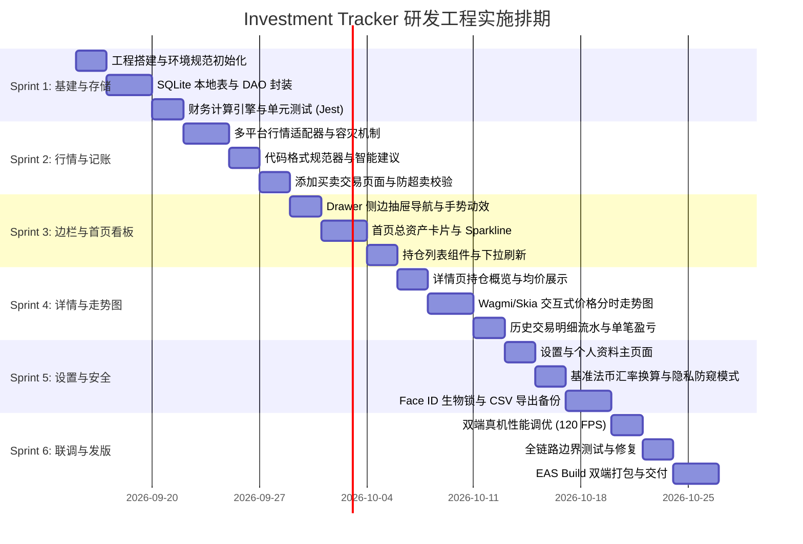

# Investment Tracker 研发工程实施计划 (Implementation Plan)

| 文档版本 | 编写日期 | 关联 PRD | 关联架构文档 |
| :--- | :--- | :--- | :--- |
| **v1.0.0** | 2026-09-11 | [`document/PRD.md`](file:///Users/rick/src/investment-tracker/document/PRD.md) | [`document/ARCHITECTURE.md`](file:///Users/rick/src/investment-tracker/document/ARCHITECTURE.md) |

---

## 1. 实施目标与阶段规划 (Project Objectives)

### 1.1 工程交付目标
在 **6 周标准周期（6 个 Sprint，每周 1 个 Sprint）** 内，基于 **React Native + Expo SDK 52+ (TypeScript)** 交付一款高性能、高信噪比、符合设计规范的 iOS / Android 跨平台加密资产跟踪 App。
- **MVP 交付范围**：
  - 极简边栏抽屉导航（Sidebar Drawer）；
  - 首页总资产与盈亏看板（支持法币切换、Sparkline 折线）；
  - 投资品持仓列表（实时单价、持仓市值、持仓盈亏）；
  - 多平台交易录入（OKX、Binance、CoinGecko、Coinbase 代码格式建议与成本推导）；
  - 投资品详情页（分时走势图、持仓均价、历史流水明细）；
  - 设置中心（防偷窥隐私模式、Face ID 安全锁、CSV 数据导出、本地备份）。

### 1.2 阶段里程碑甘特图 (Milestones)



---

## 2. 详细任务分解结构 (Work Breakdown Structure - WBS)

### Sprint 1: 工程基建与核心领域模型 (Week 1)
> **目标**：搭建标准化开发环境，完成本地数据持久化与财务计算核心，保障数据层 100% 单元测试覆盖。

- [x] **Task 1.1: 开发环境与项目脚手架搭建**
  - 初始化 Expo SDK 52+ 项目（TypeScript 严格模式，开启 React Native New Architecture）。
  - 集成 `NativeWind` (Tailwind CSS)，注入 `design/UI_DESIGN_SPEC.md` 中定义的深空暗黑主题色 Token（`#090D16`、`#10B981`、`#EF4444` 等）。
  - 配置 ESLint、Prettier、Husky 代码提交检查。
- [x] **Task 1.2: 本地 SQLite 存储层实现 (expo-sqlite)**
  - 编写数据库迁移脚本，创建 `assets`、`transactions`、`price_cache` 数据表。
  - 实现强类型仓储接口：`AssetRepository` 与 `TransactionRepository`。
  - 集成 `react-native-mmkv` 处理轻量级系统配置（法币、隐私开关等）。
- [x] **Task 1.3: 财务计算引擎核心开发 (P&L Calculation Engine)**
  - 基于 `bignumber.js` 实现移动加权平均持仓成本公式：
    $$P_{\text{avg}} = \frac{(Q_1 \times P_1) + (Q_2 \times P_2)}{Q_1 + Q_2}$$
  - 实现未实现盈亏、已实现盈亏、持仓收益率计算纯函数。
  - 编写 Jest 单元测试套件，覆盖普通买卖、多次加仓、部分减仓、清仓再买入等极端场景，确保测试覆盖率 $> 95\%$。

---

### Sprint 2: 行情适配器与交易录入模块 (Week 2)
> **目标**：打通多交易所公共行情与代码建议，完成高质量的买卖记账表单。

- [ ] **Task 2.1: 多平台行情适配器开发 (Exchange Adapters)**
  - 封装统一接口 `IExchangeAdapter`。
  - 实现 `BinanceAdapter`（格式如 `BTCUSDT`，对接 Binance 24hr Ticker API）。
  - 实现 `OKXAdapter`（格式如 `BTC-USDT`，对接 OKX API v5）。
  - 实现 `CoinbaseAdapter`（格式如 `BTC-USD`）。
  - 实现 `CoinGeckoAdapter`（按小写名称查询，如 `bitcoin`）。
- [ ] **Task 2.2: 容灾降级与缓存调度服务 (`ExchangeService`)**
  - 实现主平台请求失败/限流时，自动降级至 CoinGecko 公共端点兜底。
  - 基于 TanStack Query 实现 15 秒前台智能节流轮询与退后台自动休眠。
- [ ] **Task 2.3: 添加买卖交易页面/Modal (`AddTransactionModal`)**
  - 买入/卖出分段开关切换（绿色/红色主题色响应联动）。
  - 4 大平台快捷切换芯片（OKX、Binance、CoinGecko、Coinbase），选中时动态更新格式建议（如“💡 Binance 填 BTCUSDT 或 BTC”）。
  - 单价输入框支持“一键填充当前市价”。
  - 实时联动计算：$\text{总金额} = \text{单价} \times \text{数量}$。
  - 防超卖逻辑校验：当 `type === 'SELL'` 且卖出量大于持仓量时阻断提交并报错。

---

### Sprint 3: 边栏导航与首页看板 (Week 3)
> **目标**：实现流畅的左侧抽屉手势动效与首页总资产/持仓列表完整交互。

- [ ] **Task 3.1: 侧边栏抽屉导航 (Drawer Navigation)**
  - 集成 `@react-navigation/drawer`，配合 `react-native-gesture-handler` 实现屏幕左边缘滑动手势（Edge Swipe）。
  - 抽屉自定义组件：顶部个人卡片（头像、Rick H.、Pro 标）、中间导航条目（`Home`、`Settings/Profile`）、底部快捷区（基准法币显示、Face ID 开关、版本号）。
  - 优化滑出动效为 280ms 贝塞尔曲线，配置右侧半透明高斯模糊遮罩。
- [ ] **Task 3.2: 首页总资产卡片 (Total Portfolio Card)**
  - 大字号总资产展示，支持法币符号动态替换（`$` / `¥` / `€`）。
  - 盈亏指示器胶囊：展示累计总盈亏与当日 24h 涨跌，支持点击切换展示模式。
  - 绘制近期资产走势 Sparkline 微缩折线图。
  - 快捷操作按钮（买入记录、卖出记账、统计分析）。
- [ ] **Task 3.3: 投资品持仓列表 (Asset List)**
  - 虚拟化滚动列表（`FlashList` / `FlatList`），展示各持仓代币 Logo、代码、实时市价、持有总量、持币总市值与盈亏比例。
  - 下拉刷新手势与本地缓存瞬间渲染逻辑（秒开体验）。
  - 点击列表项携带代币 ID 平滑转场至详情页。

---

### Sprint 4: 投资品详情走势与历史流水 (Week 4)
> **目标**：交付高性能的分时图表交互与该代币全生命周期的买卖流水记录。

- [ ] **Task 4.1: 投资品详情页面概览 (`AssetDetailScreen`)**
  - 顶部持仓价值卡片：当前持仓市值、持币数量、持仓均价（Cost Basis）与累计收益。
- [ ] **Task 4.2: 交互式价格走势图表开发 (Wagmi Charts / Skia)**
  - 周期切换选项卡：`24H`、`1W`、`1M`、`1Y`、`ALL`。
  - 根据选定周期拉取历史 K 线/折线数据点阵。
  - 实现触摸十字光标（Touch Scrubbing）：手指在图表滑动时长按停顿时，动态展示对应历史时间点的价格与未实现收益，并触发轻微震动触觉反馈（Haptic Feedback）。
- [ ] **Task 4.3: 历史交易明细流水组件**
  - 按时间倒序展示该代币的所有买卖明细。
  - 交易卡片标明：买入/卖出徽标、成交日期、成交平台、成交单价、成交数量。
  - 动态计算并展示：买入单展示当前未实现盈亏，卖出单展示结算已实现盈亏。

---

### Sprint 5: 设置中心、安全与数据可携性 (Week 5)
> **目标**：实现用户偏好设置、防偷窥模式、Face ID 安全防护与数据导出能力。

- [ ] **Task 5.1: 设置与个人中心页面 (`SettingsScreen`)**
  - 分组列表排版：偏好设置、交易所与数据、安全与隐私、关于与版本。
- [ ] **Task 5.2: 基准法币切换与汇率引擎**
  - 提供 USD ($)、CNY (¥)、EUR (€) 切换。
  - 接入公共法定汇率接口，定时更新汇率缓存；切换币种后，全局资产看板与持仓市值自动无缝重算。
- [ ] **Task 5.3: 防偷窥隐私模式 (Privacy Mode)**
  - 开启隐私开关后，主页总资产与各代币金额脱敏显示为 `••••••`。
  - 监听 App 状态变化（AppState），切出到系统多任务卡片（App Switcher）时自动施加全屏高斯模糊，防止系统后台截屏泄密。
- [ ] **Task 5.4: 生物识别安全锁 (Local Authentication)**
  - 集成 `expo-local-authentication`，支持 Face ID、Touch ID 与锁屏密码。
  - 应用进入前台时阻断显示并呼起生物识别验证。
- [ ] **Task 5.5: 数据导出与本地备份**
  - 实现导出 CSV：将本地 `transactions` 格式化为标准 CSV 文件，通过原生分享面板（AirDrop、微信、邮件、保存到文件）导出。
  - 支持导入/导出 JSON 加密备份包，实现安全迁移。

---

### Sprint 6: 双端联调、测试验收与发版 (Week 6)
> **目标**：进行全系统集成测试、性能压测、打包与发版交付。

- [ ] **Task 6.1: 双端真机性能调优**
  - 监控并确保列表滑动与走势图手势交互稳定在 **60 ~ 120 FPS**。
  - 针对微小面值代币（如 PEPE, SHIB 等 8 位小数）进行界面排版防换行与截断测试。
  - 检查内存泄漏，确保长时间轮询不发生崩溃。
- [ ] **Task 6.2: 边界与异常全链路测试**
  - 断网离线测试：飞行模式启动，验证本地 SQLite 数据是否完整秒开。
  - 平台 API 异常模拟：模拟 Binance 403 限流，验证是否平滑降级至 CoinGecko。
  - 极端交易数据测试：录入 100+ 笔流水，测试持仓均价计算速度与列表滚动流畅度。
- [ ] **Task 6.3: EAS Build 打包与交付**
  - 配置 `app.json` 图标、启动页（Splash Screen）、权限申请描述（Face ID 提示语）。
  - 执行 iOS 构建，交付 TestFlight 测试包。
  - 执行 Android 构建，交付 Release APK / AAB 安装包。
- [ ] **Task 6.4: 交付物整理与技术文档交割**
  - 交付源代码仓库、打包产物及项目使用说明书。

---

## 3. 质量保障与验收标准 (Definition of Done - DoD)

每个功能在合并并标记为完成前，必须满足以下验收条件：

| 验收维度 | 具体执行标准 |
| :--- | :--- |
| **代码质量** | TypeScript 编译零错误；ESLint 与 Prettier 检查零报错；无遗留调试日志 (`console.log`)。 |
| **单元测试** | 财务计算核心（加权成本、盈亏）必须有单元测试覆盖，覆盖率 $\ge 90\%$。 |
| **设计还原度** | 严格还原 `design/UI_DESIGN_SPEC.md` 的颜色 Token、间距、圆角与边栏抽屉手势动效。 |
| **性能基准** | 冷启动时间 $\le 1.0$ 秒；列表滑动无掉帧卡顿（稳定 60/120 FPS）。 |
| **双端一致性** | 必须在真实 iPhone (iOS 15+) 及 Android 旗舰机/千元机实机上验证通过。 |
| **异常防护** | 卖出超持仓必须拦截阻断；离线状态正常展示最后缓存并友好提示。 |

---

## 4. 关键风险与应对预案 (Risk Management)

| 潜在风险 | 影响程度 | 触发场景 | 预防与应对策略 |
| :--- | :---: | :--- | :--- |
| **API 速率限制 (Rate Limit)** | 高 | 用户频繁切换或持币过多，导致交易所封禁 IP。 | 前端严格限制轮询间隔（最小 15 秒）；退后台立即暂停请求；配置 CoinGecko 作为备用容灾源。 |
| **浮点数计算精度偏差** | 极高 | JavaScript 原生 `0.1 + 0.2 = 0.30000000000000004` 导致财务对不上账。 | **严禁**直接使用原生 `number` 进行加减乘除，领域计算层全量采用 `bignumber.js` 进行定点运算。 |
| **复杂走势图低端机掉帧** | 中 | 历史点位过多（如全周期 1000+ 点）导致图表手势卡顿。 | 采用 **LTTB (Largest-Triangle-Three-Buckets)** 降采样算法，将绘制点位压缩至 150~200 个最优视觉点；开启 GPU Skia 加速。 |
| **跨平台抽屉手势冲突** | 中 | Android 原生返回手势与左侧屏幕边缘滑出抽屉冲突。 | 使用 React Navigation 官方 Edge Gesture 逻辑，调整触发边缘宽度（`edgeWidth: 30`），避免与系统返回手势打架。 |

---

## 5. 项目工程依赖清单 (Dependency Baseline)

```json
{
  "dependencies": {
    "expo": "~52.0.0",
    "react": "18.3.1",
    "react-native": "0.76.x",
    "nativewind": "^4.1.0",
    "@react-navigation/native": "^7.0.0",
    "@react-navigation/drawer": "^7.0.0",
    "@react-navigation/native-stack": "^7.0.0",
    "react-native-gesture-handler": "~2.20.0",
    "react-native-reanimated": "~3.16.0",
    "expo-sqlite": "~15.0.0",
    "react-native-mmkv": "^3.1.0",
    "react-native-wagmi-charts": "^2.3.0",
    "@shopify/react-native-skia": "1.5.0",
    "bignumber.js": "^9.1.2",
    "@tanstack/react-query": "^5.60.0",
    "zustand": "^5.0.0",
    "expo-local-authentication": "~15.0.0",
    "expo-secure-store": "~14.0.0",
    "expo-sharing": "~13.0.0",
    "expo-file-system": "~18.0.0"
  },
  "devDependencies": {
    "@types/react": "~18.3.12",
    "typescript": "^5.3.3",
    "jest": "^29.2.1",
    "tailwindcss": "^3.4.0",
    "eslint": "^8.57.0",
    "prettier": "^3.3.0"
  }
}
```
