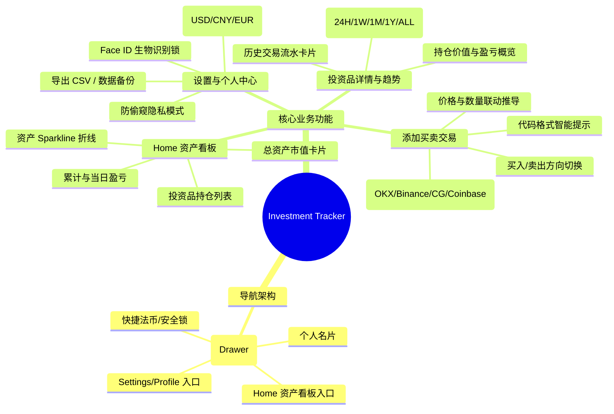

# Investment Tracker 产品需求规格说明书 (PRD)

| 文档版本 | 创建日期 | 状态 | 适用平台 |
| :--- | :--- | :--- | :--- |
| **v1.0.0 (MVP)** | 2026-09-11 | 审核发布 | iOS & Android 移动端 |

---

## 1. 产品背景与定位 (Product Overview)

### 1.1 背景与痛点
个人投资者在加密货币（及后续股票）投资中，通常面临以下痛点：
1. **资产分散**：资产散落在 OKX、Binance、Coinbase 等多个交易所及冷热钱包中，难以一站式直观获知总盈亏。
2. **中心化平台隐私泄露**：主流记账软件要求注册账号、上传财务数据到云端，存在严重的资产隐私泄露风险。
3. **界面冗余复杂**：传统交易所或财务软件功能繁杂（合约、跟单、理财），投资者仅需“一秒查看资产盈亏”的高信噪比界面。

### 1.2 产品定位与目标
- **定位**：一款极简、高信噪比、**本地离线优先（Local-First）**的跨平台资产收益跟踪工具。
- **阶段目标**：
  - **初期（Phase 1 / MVP）**：聚焦**加密货币（Crypto）**，实现多平台买卖数据录入、实时行情跟踪、加权平均持仓成本核算与盈亏趋势分析。
  - **后续（Phase 2）**：平滑拓展至**股票资产（美股/港股/A股）**，支持多币种汇率统一换算与资产配置比例报表。

---

## 2. 用户角色与核心场景 (User Persona & Use Cases)

| 用户角色 | 典型使用场景 | 核心诉求 |
| :--- | :--- | :--- |
| **加密资产定投/波段者** | 在 Binance 或 OKX 买入代币后，打开 App 记一笔交易。 | 操作步骤必须在 3 步内完成，代币格式有建议提示，无需手动换算总价。 |
| **日常行情跟踪者** | 在地铁、通勤或工作间隙，快速点开 App 查看今日盈亏。 | 启动速度极快，首屏一目了然；具备“防偷窥模式”，防止旁人看到资产金额。 |
| **多笔持仓复盘者** | 点击特定币种（如 BTC）查看自己的平均持仓成本及分时走势。 | 走势图交互丝滑，清晰查看各笔历史买卖点位及未实现收益。 |

---

## 3. 功能需求规格详细说明 (Functional Requirements)

---

### 3.1 导航架构：侧边栏抽屉 (Sidebar Drawer)

- **功能编号**：`FR-NAV-01`
- **需求描述**：
  - 针对初期功能聚焦的特性，**放弃多余的底部 4 栏 Tab 导航**，采用左侧滑动呼出的侧边栏抽屉（Sidebar Drawer）设计。
- **详细交互规格**：
  1. **触发入口**：点击主屏左上角汉堡图标 `☰`，或支持在屏幕左侧边缘右滑手势（Edge Swipe）。
  2. **顶部个人名片**：展示用户头像、昵称（如 `Rick H.`）、账户标识（`Crypto Track Pro`）。
  3. **核心导航条目**：
     - 🏠 **资产看板 (Portfolio Home)**：选中时高亮展示微光边框与蓝色背景，点击收起抽屉并回到首页。
     - ⚙️ **设置与个人 (Settings & Profile)**：点击进入系统设置页面。
  4. **底部快捷区**：
     - 当前基准法币状态（如 `USD ($)`）；
     - Face ID / 指纹安全锁开关；
     - 客户端当前版本号标识（如 `v1.0.0`）。
  5. **关闭机制**：点击右侧半透明遮罩蒙层、向左滑动抽屉或点击返回键即可平滑关闭。

---

### 3.2 首页资产看板 (Home Dashboard)

- **功能编号**：`FR-HOME-01`
- **页面构成**：

#### 1. 顶部总资产卡片 (Total Portfolio Card)
- **总资产金额展示**：以大字号突出显示组合当前总价值（如 `$128,450.80`），精确到 2 位小数。
- **盈亏状况看板**：
  - 展示**累计总盈亏金额与百分比**（如 `+$14,230.50 (+12.4%)`）；
  - 盈利为翡翠绿（`#10B981`），亏损为珊瑚红（`#EF4444`）；
  - 支持点击在“累计盈亏”与“当日 24h 涨跌”之间一键切换。
- **迷你走势图 (Sparkline)**：展示总组合近 7 日或近 30 日的资产曲线。
- **卡片右上角快捷入口**：右上角配备「分析」胶囊按钮，点击可一键查看资产配比与统计分析弹窗。

#### 2. 投资品持仓列表 (Asset Holdings List)
- **列表项信息展示**：
  - **左侧基本信息**：代币官方 Logo、全称（如 `Bitcoin`）、所属交易平台徽标（如 `Binance`）、代码与持有数量（如 `BTC • 6`）；
  - **右侧资产总值与盈亏指标**：
    - **顶部大字号总市值**：展示该资产当前持仓总市值（如 `$463,493.94`），不附加冗余的“盈亏”标签以避免概念混淆；
    - **底部具体盈亏与收益率**：移除实时代币单价，直观高亮展示该资产具体的未实现盈亏金额与收益率百分比（如 `+$100.00 (+0.0%)` 或 `-$200.00 (-5.2%)`），统一以翡翠绿/珊瑚红呈现，并完全适配多法币汇率折算与隐私脱敏模式。
- **交互规则**：
  - 点击列表中的任意投资品卡片，打开对应的**投资品详情页**。
  - 支持下拉刷新（Pull-to-Refresh）强制拉取最新行情。

---

### 3.3 添加买卖交易 (Add Transaction)

- **功能编号**：`FR-TX-01`
- **页面构成与交互流程**：

#### 1. 交易方向选择 (Buy / Sell Toggle)
- 顶部高亮分段开关：**买入 (Buy)** / **卖出 (Sell)**。
- 选买入时操作按钮呈翡翠绿色，选卖出时呈珊瑚红色。

#### 2. 买入与卖出差异化资产选择 (Asset & Platform Selection)
- **买入模式 (Buy Mode - 双入口差异化逻辑)**：
  - **入口 1：从首页点击「+ 记一笔」进入买入**：
    - 保持完全自由选择：提供四大内置平台快捷芯片（OKX、Binance、CoinGecko、Coinbase），单选激活；
    - 支持自由输入任意代币代码（如 BTC, ETH, SOL），并展示当前平台的建议格式提示（如 `Binance 填 BTCUSDT`）。
  - **入口 2：从具体持仓页面（Asset Detail）点击「买入」**：
    - **直接锁定当前持仓的平台与代币**；
    - 隐藏自由平台芯片与代币输入框，展示精致的「买入目标资产」锁定卡片，右侧带有「当前持仓已锁定」提示徽章；
    - 自动填入当前平台该代币的最新实时市价，用户仅需输入买入数量即可快速完成加仓/补仓记账。
- **卖出模式 (Sell Mode - 双入口差异化逻辑)**：
  - **规则宗旨**：卖出必须依附于已有真实持仓，杜绝做空与无源输入；
  - **入口 1：从首页点击「+ 记一笔」进入卖出**：
    - 隐藏平台自由芯片与代币文本输入框；
    - 提供**现有持仓下拉选择框**，仅展示当前持有量大于 0 的资产（包含代币图标、名称、代码、所属平台徽标及可用持仓数量）；
    - 选中持仓后，自动带出当前持仓数量作为上限，并自动向对应平台拉取并填入最新实时市价；
    - 若本地尚无任何可卖出持仓，显示优雅暗黑风空状态引导卡片「当前暂无可卖出的持仓资产，请先记录买入」，并支持一键切换回买入模式。
  - **入口 2：从持仓详情界面（Asset Detail）点击「卖出」**：
    - **下拉框直接锁定当前持仓**，右侧显示「当前持仓已锁定」锁图标徽章，不可切换其他币种或平台；
    - 用户仅可针对当前持仓卖出**全部或一部分**（支持点击“全部卖出”快捷芯片一键填入，或手动键入部分数量）。

#### 3. 价格、数量与总额推导 (Price & Quantity Calculation)
- **成交单价 (Price)**：支持用户手动输入，并提供 **“填入市价”** 按钮；
  - **市价自动获取机制**：仅在弹窗首次打开，或用户**修改了代币代码**、**切换了交易平台**、**从下拉框选择了不同持仓**时，自动向对应平台获取最新市价**一次**；
  - **稳定性保证**：获取一次后立即锁定，不再进行后台轮询或自动重复刷新，杜绝表单内容被外部轮询重置或覆盖（如输入 DOGE 绝不会被冲掉重置为 BTC）；用户如需最新价可随时点击「填入市价」手动刷新。
- **成交数量 (Quantity)**：支持高精度浮点数（加密货币需支持至小数点后 6~8 位）；卖出时提供 **“全部卖出”** 快捷胶囊。
- **总额联动计算**：系统自动执行 $\text{Total} = \text{Price} \times \text{Quantity}$ 并实时展示在“交易总金额”小结栏。
- **校验逻辑**：
  - 单价必须 $\ge 0$；数量必须 $> 0$；
  - 卖出操作时，若卖出数量大于当前持仓量，输入框实时显示红色预警文字，提交时使用统一的 CustomAlertModal 优雅弹出提示并提供「一键全部卖出」修复选项（不允许超卖做空）。

#### 4. 交易日期与时间录入 (Date & Time Field)
- **可选自定义时间**：支持用户补录历史交易或自定义精确买卖时间点；
- **默认取当前时间**：若用户不输入日期（保持留空），提交时系统自动以当前设备系统时间（`Date.now()`）作为交易发生时间戳；
- **便捷操作按钮**：日期标签右侧提供「设为现在」一键填入当前时间，输入内容后动态显示「清空」按钮；
- **多格式智能解析**：支持标准格式 `YYYY-MM-DD HH:mm`、带秒数 `YYYY-MM-DD HH:mm:ss`、仅日期 `YYYY-MM-DD`（自动补充当前时分秒）及斜杠分隔 `YYYY/MM/DD`；
- **异常日期拦截**：若输入的日期不合规（如平年 2 月 31 日、月份越界或格式错乱），提交时弹窗拦截并引导修正；
- **时序与流水对齐**：填入的时间戳直接持久化至数据库 `transactions.timestamp` 字段，并在交易明细历史中按倒序精准呈现。

---

### 3.4 投资品详情与趋势 (Asset Detail Screen)

- **功能编号**：`FR-DETAIL-01`
- **页面构成**：

#### 1. 顶部持仓概览卡片
- 展示当前持有总市值（如 `$68,420.00`）；
- 展示持有代币数量、当前市场单价及 24h 涨跌幅度；
- 展示该币种的**加权持仓成本均价**与**累计未实现盈亏**。

#### 2. 分时交互价格走势图 (Price Trend Chart)
- **周期 Tab 切换**：支持 `24H`（日内走势）、`1W`（周）、`1M`（月）、`1Y`（年）、`ALL`（全部）。
- **交互特性**：
  - 采用平滑贝塞尔面积渐变折线；
  - 支持手指长按屏幕在图表上左右滑动查看十字游标（Scrubbing），动态展示对应历史时间点的价格与盈亏。

#### 3. 详细交易历史流水 (Transaction History)
- 按交易时间倒序排列所有买卖记录。
- **每笔交易卡片包含**：
  - 交易类型标签（买入为绿色 `Buy`，卖出为红色 `Sell`）；
  - 交易发生日期（如 `2026-05-12`）与交易平台标签；
  - 成交数量与成交单价（如 `+0.50 BTC @ $60,000`）；
  - 对应笔次盈亏（买入展示当前未实现盈亏，卖出展示结算已实现盈亏）。

---

### 3.5 设置与个人中心 (Settings & Profile)

- **功能编号**：`FR-SET-01`
- **功能清单**：
  1. **基准法币切换 (Base Currency)**：
     - 支持设置主计价法币：`USD ($)`、`CNY (¥)`、`EUR (€)`；
     - 切换后全局资产看板自动按最新实时汇率折算显示。
  2. **防偷窥隐私模式 (Privacy Mode)**：
     - 开关开启后，主页总资产与各持仓金额全部脱敏显示为 `••••••`，保护公共场合财务隐私。
  3. **数据管理、导出与清空 (Data Portability & Reset)**：
     - **导出 CSV**：一键生成全量交易明细 `.csv` 表格，支持系统原生分享；
     - **本地备份与恢复**：导出/导入本地加密 JSON 备份文件；
     - **清空所有数据 (Clear All Data)**：提供高危红线数据清空入口，用于彻底清除本地所有持仓资产与历史交易流水。点击时触发强警示确认弹窗，确认后彻底清除本地数据并重置为空白看板，支持从头重新记账。
  4. **安全锁 (Security)**：
     - 支持开启 Face ID / Touch ID / 锁屏密码保护，切出 App 后重新打开时需生物验证。

---

## 4. 业务规则与财务计算模型 (Business Rules)

### 4.1 持仓加权均价核算规则 (Weighted Average Cost Basis)
- 用户的持仓成本均价仅在**买入 (BUY)**时更新，公式为：
  $$P_{\text{avg}} = \frac{(Q_{\text{prev}} \times P_{\text{prev\_avg}}) + (Q_{\text{buy}} \times P_{\text{buy}})}{Q_{\text{prev}} + Q_{\text{buy}}}$$
- **卖出 (SELL)**时：
  - 不改变剩余持仓的成本均价 $P_{\text{avg}}$；
  - 扣减剩余持币数量：$Q_{\text{remain}} = Q_{\text{prev}} - Q_{\text{sell}}$；
  - 立即结算该笔卖出的**已实现盈亏**：$\text{PnL}_{\text{realized}} = (P_{\text{sell}} - P_{\text{avg}}) \times Q_{\text{sell}} - \text{Fee}$。

### 4.2 未实现盈亏核算规则 (Unrealized P&L)
- 当前未实现盈亏：
  $$\text{PnL}_{\text{unrealized}} = (P_{\text{market}} - P_{\text{avg}}) \times Q_{\text{remain}}$$
- 持仓回报率：
  $$\text{Return Rate \%} = \frac{P_{\text{market}} - P_{\text{avg}}}{P_{\text{avg}}} \times 100\%$$

---

## 5. 非功能性需求 (Non-Functional Requirements - NFR)

### 5.1 性能与交互指标
- **帧率体验**：页面滑动、走势图手势拖拽、侧边抽屉呼出均必须达到 **60 FPS ~ 120 FPS**，无卡顿感。
- **冷启动耗时**：冷启动至渲染出首屏资产总值 $\le 1.0$ 秒。
- **离线秒开**：无网络或飞行模式下，读取本地 SQLite 缓存数据，保证界面正常展示并标记“离线缓存”。

### 5.2 隐私与安全性 (Privacy & Security)
- **本地优先（Local-First）**：绝不强迫用户绑定手机号/邮箱注册，核心交易流水 100% 留存在手机本地。
- **硬件级敏感数据防护**：若用户配置交易所只读 API Key，必须存储于 iOS Keychain / Android KeyStore 中。

### 5.3 跨平台支持
- **iOS**：支持 iOS 15.0 及以上版本（适配全面屏安全区、动态岛与系统深色模式）。
- **Android**：支持 Android 10 (API 29) 及以上版本，支持原生返回键与手势导航适配。

### 5.4 国际化与多语言支持 (Internationalization - i18n)
- **多语言阶段规划**：第一步优先交付**简体中文 (zh-CN)** 与 **英文 (en-US)** 完整双语支持，后续版本扩展日语、韩语等。
- **动态无感切换**：在设置中心或侧边栏切换语言后，全局界面（看板、持仓、图表、明细、弹窗、提示等）即时响应重绘，无需重启应用。
- **本地持久化**：用户选择的语言偏好持久化保存在本地 SQLite 数据库中，冷启动与断网环境下保持用户设定。

---

## 6. 异常场景与边界处理 (Edge Cases)

| 异常场景 | 触发条件 | 处理逻辑与用户反馈 |
| :--- | :--- | :--- |
| **超额卖出** | 记录卖出数量大于当前持仓可用量。 | 阻断提交，表单下方以红色文字提示：“卖出数量不能超过当前持仓可用量 (X.XX)”。 |
| **网络异常 / 平台限制** | Binance/OKX 行情接口超时或 403。 | 自动无缝降级切换至 CoinGecko 公共 API；若全部离线，显示最后一次更新时间。 |
| **极端精度代币** | PEPE、SHIB 等微小单价代币（如 $0.00001234）。 | 系统单价字段支持最高 8 位小数显示，避免出现被四舍五入为 $0.00 的情况。 |
| **多任务切出** | 用户切出 App 查看其他应用。 | 若开启“隐私模式”或“安全锁”，在系统后台多任务卡片中自动模糊界面，防止截屏泄露。 |
| **清空数据防误触** | 用户在系统设置中点击“清空所有数据”。 | 弹出强警示确认弹窗（包含不可撤销警告与导出备份建议），必须明确点击红色“确认清空”后方执行数据库清空操作，防止误触。 |

---

## 7. 产品实施与发版计划 (Release Roadmap)

| 里程碑 | 版本 | 核心功能范围 |
| :--- | :--- | :--- |
| **M1: 核心记账与存储** | `v0.1.0-alpha` | 本地 SQLite 存储、加权成本算法、添加买卖基础表单。 |
| **M2: 视觉与边栏交互** | `v0.5.0-beta` | 侧边栏抽屉导航、深色资产看板、各平台代币格式建议。 |
| **M3: 行情与趋势交付** | `v1.0.0-MVP` | 多平台行情实时拉取、分时走势图、交易明细流水、CSV 导出。 |
| **M4: 股票与进阶演进** | `v2.0.0` | 扩展美股/港股/A股持仓跟踪、交易所只读 API 自动对账导入。 |
