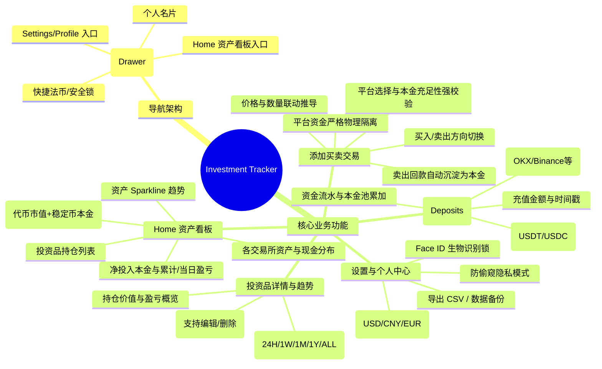

# Investment Tracker 产品需求规格说明书 (PRD)

| 文档版本 | 创建日期 | 状态 | 适用平台 |
| :--- | :--- | :--- | :--- |
| **v1.3.0** | 2026-09-14 | 审核发布 | iOS & Android 移动端 |

---

## 1. 产品背景与定位 (Product Overview)

### 1.1 背景与痛点
个人投资者在加密货币（及后续股票）投资中，通常面临以下痛点：
1. **资产与资金分散**：资产与现金散落在 OKX、Binance、Coinbase 等多个交易所及冷热钱包中，难以一站式直观获知跨所总财产与总盈亏。
2. **中心化平台隐私泄露**：主流记账软件要求注册账号、上传财务数据到云端，存在严重的资产隐私泄露风险。
3. **记账逻辑脱离现实**：传统轻量记账软件允许“凭空记录买入”，缺乏现实中“交易所必须先入金/充值本金，方可挂单买入”的资金约束，导致投资者无法清晰核算真实投入本金与闲置流动性（USDT/USDC 储备）。

### 1.2 产品定位与角色升级
- **核心定位**：一款极简、高信噪比、**本地离线优先（Local-First）的多交易所聚合资管与投资收益跟踪工具**。
- **角色定位升级 (Exchange Aggregator)**：
  - App 转换为**“多个交易所的聚合管理平台”**；
  - **交易所资金沙盒（Exchange Silo）**：每个交易平台（OKX、Binance、Coinbase 等）均作为独立的资金与资产核算单元；
  - **先充值后买入（Deposit-First Trading）**：任何平台上的买入交易，必须以该平台已充值且充足的可用本金（稳定币 USDT / USDC）为前提；
  - **平台本金严格物理隔离**：各交易所的充值本金各自独立，A 交易所的资金不得跨所用于购买 B 交易所的代币。
- **阶段目标**：
  - **初期（Phase 1 / MVP）**：聚焦**加密货币（Crypto）与多交易所资金聚合**，实现平台充值、稳定币本金校验、多平台代币买卖流水、实时行情、加权平均持仓成本与跨所总财产收益分析。
  - **后续（Phase 2）**：平滑拓展至**股票资产（美股/港股/A股券商）**，支持多币种法定本金入金、汇率统一换算与跨资产类别配置报表。

---

## 2. 用户角色与核心场景 (User Persona & Use Cases)

| 用户角色 | 典型使用场景 | 核心诉求 |
| :--- | :--- | :--- |
| **多交易所资金管理者** | 在 OKX、Binance 分别充值 USDT 准备抄底或定投，并记录资金注入。 | 平台资金严格隔离，清晰掌握各交易所当前闲置现金（USDT/USDC）与代币资产总和。 |
| **加密资产定投/波段者** | 在 OKX 使用已充值的 USDT 买入 BTC，或卖出 BTC 回笼 USDT。 | 自动检查该平台本金是否充足；买入自动扣减本金，卖出回款自动增计本金，代币格式建议智能。 |
| **日常行情与资产跟踪者** | 在通勤或碎片时间，快速查看全平台资产总值（代币市值 + 稳定币本金）与今日盈亏。 | 启动速度极快，首屏一目了然；具备“防偷窥模式”，防止旁人看到资产金额。 |
| **多笔持仓复盘者** | 点击特定币种查看平均持仓成本、各交易所买入点位与分时走势。 | 走势图交互丝滑，清晰查看各笔历史买卖点位及未实现收益。 |

---

## 3. 功能需求规格详细说明 (Functional Requirements)

---

### 3.1 导航架构：侧边栏抽屉 (Sidebar Drawer)

- **功能编号**：`FR-NAV-01`
- **需求描述**：
  - 针对初期功能聚焦的特性，**放弃多余的底部 4 栏 Tab 导航**，采用左侧滑动呼出的侧边栏抽屉（Sidebar Drawer）设计。
- **详细交互规格**：
  1. **触发入口**：点击主屏左上角汉堡图标 `☰`，或支持在屏幕左侧边缘右滑手势（Edge Swipe）。
  2. **顶部个人名片**：展示用户头像、昵称（如 `Rick H.`）、账户标识（`Crypto Track Pro`）。
  3. **核心导航条目**：
     - 🏠 **资产看板 (Portfolio Home)**：选中时高亮展示微光边框与蓝色背景，点击收起抽屉并回到首页。
     - ⚙️ **设置与个人 (Settings & Profile)**：点击进入系统设置页面。
  4. **底部快捷区**：
     - 当前基准法币状态（如 `USD ($)`）；
     - Face ID / 指纹安全锁开关；
     - 客户端当前版本号标识（如 `v1.0.0`）。
  5. **关闭机制**：点击右侧半透明遮罩蒙层、向左滑动抽屉或点击返回键即可平滑关闭。

---

### 3.2 首页资产看板 (Home Dashboard)

- **功能编号**：`FR-HOME-01`
- **页面构成**：

#### 1. 顶部总资产卡片 (Total Portfolio Card)
- **聚合总财产金额展示**：以大字号突出显示组合当前全平台总资产（如 `$4,049,905.10`），精确到 2 位小数。
  - **总资产核算口径**：$\text{总资产} = \text{各平台加密代币持仓实时市值} + \text{各平台稳定币可用本金余额之和}$；
  - 真实反映用户在所有交易所内的“总身家”（既包括已买入持仓波动的币，也包括闲置待买入的现金本金）。
- **盈亏状况看板（双模式一键切换）**：
  - **累计盈亏模式 (Cumulative PnL)**：
    - **金额核算**：$\text{总净盈亏} = \text{全平台总财产} - \text{全平台累计净充值本金}$；
    - **回报率分母（总充值本金优先原则）**：当用户录入了充值本金流水（$\text{Total Net Deposits} > 0$）时，胶囊标签内累计收益率**严格以全部充值净本金为分母**（$\frac{\text{总净盈亏}}{\text{全平台累计净充值本金}} \times 100\%$），确保大字号总资产、收益额与总投入在数学逻辑上完全对应（例如：401 万本金赚 3.99 万，严格显示为 `+$39,905.10 (+1.00%) 累计盈亏 ⇄`）；仅在无充值记录的纯记账模式下回退为代币买入成本。
  - **24小时波动模式 (24H Daily Change)**：
    - **严谨金额变动推导**：各代币按 24h 前单价基准市值（$V_0 = \frac{V_1}{1 + r}$）计算真实美元变动 $\Delta V = V_1 - V_0$（避免直接用当前现值乘以涨跌幅导致大涨大跌时成倍夸大收益或少算亏损）；
    - **组合波动率基准**：以 24h 前期初总资产（$\text{Current Total} - \sum \Delta V$）为分母计算百分比；
    - **高精度金融格式化**：百分比统一保留 **2 位小数**（如 `+0.02%`），并针对微小非零波动做防截断保护，杜绝产生 `+0.0%` 的死板四舍五入。
  - 盈利为翡翠绿（`#10B981`），亏损为珊瑚红（`#EF4444`），点击标签右侧 `⇄` 图标无缝切换。
- **资产构成概览 (Holdings vs. Cash Reserves)**：
  - 卡片下方以轻量标签/条形比例展示：`代币市值: $118,450.80 (92.2%)` 与 `可用本金: $10,000.00 (7.8%)`；
- **迷你走势图 (Sparkline)**：展示总资产近 7 日或近 30 日的资产曲线。
- **卡片右上角快捷入口**：
  - 配备「+ 充值本金」与「+ 记一笔」核心快捷按钮；
  - 配备「分析」胶囊按钮，点击查看各交易所资产分布与币种配置比例。

#### 2. 各交易所资产与本金概览 (Exchange Distribution Cards)
- 展示用户在各个交易所的资产沙盒概况：
  - **OKX**：代币市值 `$45,000` + 可用本金 `$2,500 USDT`；
  - **Binance**：代币市值 `$70,000` + 可用本金 `$7,500 USDT / USDC`；
- 直观呈现不同平台间的资金沉淀，各平台本金清晰可见、互不混淆。

#### 3. 投资品持仓列表 (Asset Holdings List)
- **列表分区标题栏 (Section Header)**：
  - 标题行左侧展示「资产列表」及当前持仓代币总市值（如 `$182,297.84`）；
  - **代币资产包累计回报率展示**：紧随总市值后方高亮展示当前所有代币相对于买入建仓总成本（`Total Cumulative Cost Basis`）的**代币整体全周期投资回报率**（如 `(+26.30%)`），带涨跌颜色标识，并在隐私模式下脱敏为 `(••%)`；
  - 标题行右侧配备「+ 记一笔」快捷入口。
- **列表项信息展示**：
  - **左侧基本信息**：代币官方 Logo（支持 SVG 与智能自动抓取 CDN）、全称（如 `Bitcoin`）、所属交易平台徽标（如 `Binance`）、代码与持有数量（如 `BTC • 6`）；
  - **右侧资产总值与盈亏指标**：
    - **顶部大字号总市值**：展示该资产当前持仓总市值（如 `$463,493.94`）；
    - **底部具体盈亏与收益率**：直观高亮展示该资产具体的未实现盈亏金额与收益率百分比（如 `+$100.00 (+0.0%)` 或 `-$200.00 (-5.2%)`），统一以翡翠绿/珊瑚红呈现，并完全适配多法币汇率折算与隐私脱敏模式。
- **交互与排序规则**：
  - **智能排序机制 (Intelligent Holdings Sorting)**：
    - **有效持仓置顶**：当前持有量大于 0 的资产排在前面，并默认按持仓市值（`marketValue`）从大到小降序排列，让核心主力仓位一目了然；
    - **清仓代币自动沉底**：当前持仓量为 0（已全部卖出/已清仓）的代币自动放置在列表最后，避免干扰核心持仓视野，同时保留点击复盘历史流水的入口。
  - 点击列表中的任意投资品卡片，打开对应的**投资品详情页**。
  - 支持下拉刷新（Pull-to-Refresh）强制拉取最新行情。

---

### 3.3 平台本金充值与提现管理 (Capital Deposits & Withdrawals)

- **功能编号**：`FR-CAP-01`
- **设计定位**：独立的交易所资金沙盒管理弹窗（`DepositModal`），与代币买卖记账（`AddTransactionModal`）彻底解耦，提供专属且清晰的资金出入金管道。
- **设计宗旨**：
  - 确立“多交易所聚合平台”的资金沙盒规则。用户在某平台买入代币前，该平台必须首先存在已充值的购买本金；
  - 简化充值逻辑：统一以美元稳定币 **`USDT`** 计价与计算，不再区分多币种，去除了币种选择步骤，提升记账效率。
- **页面构成与交互流程**：
  1. **触发入口**：
     - 首页「本金列表」右上角 `+ 充值` 按钮；
     - 点击「本金列表」中的任意平台本金卡片（如点击 `OKX USDT`，自动预选平台）；
     - 交易买入时若本金不足，系统提示弹窗内一键跳转「去充值」。
  2. **业务模式切换 (Deposit / Withdraw Tabs)**：
     - **充值 (Deposit)**：记录向交易所注入可用本金（如 OTC 买 U、链上充值、法币入金）；
     - **提现 (Withdraw)**：记录从交易所转出或消费本金（如出金法币、转入冷钱包），减少该平台闲置本金。
  3. **核心表单要素**：
     - **目标平台 (Target Platform)**：单选激活目标平台（OKX、Binance、CoinGecko、Coinbase 等）；选择平台栏右侧实时动态展示当前平台可用 USDT 余额（例如 `当前平台OKX可用: $1,250.00`）；
     - **操作金额 (Amount)**：统一以 `USDT` 计价（必须 $> 0$，支持高精度浮点数）；
       - **全部提现快捷键**：在提现模式下，提供「全部提现」胶囊按钮，一键填入当前平台全部可用 USDT；
     - **发生时间 (Timestamp)**：默认取当前系统时间，支持用户自定义补录历史日期（格式化为 `YYYY-MM-DD HH:mm`）；
     - **备注 (Notes)**：可选文本（如“OTC 入金”、“提到冷钱包”等）。
  4. **资金边界与安全性校验**：
     - **提现严格防透支**：$\text{Withdraw Amount} \le \text{Available Balance}(\text{Platform}, \text{USDT})$；
     - 若提现金额超过该平台可用本金，实时显示红色警示并禁用提交按钮。
  5. **会计账务与计算模型**：
     - 资金流水记录入库（`currency = 'USDT'`，`type = 'DEPOSIT'` 或 `'WITHDRAW'`）；
     - **平台可用本金更新**：
       $$\text{Balance}(Platform, \text{USDT}) = \sum \text{Deposits} - \sum \text{Withdrawals} - \sum \text{Buy Costs} + \sum \text{Sell Proceeds}$$
     - **全平台累计净投入本金更新**：
       $$\text{Total Net Deposits} = \sum \text{Deposits} - \sum \text{Withdrawals}$$
     - 全平台总财产与全周期投资净盈亏自动同步联动重算。

---

### 3.4 添加买卖交易 (Add Transaction)

- **功能编号**：`FR-TX-01`
- **页面构成与交互流程**：

#### 1. 交易方向选择 (Buy / Sell Toggle)
- 顶部高亮分段开关仅包含：**买入 (Buy)** / **卖出 (Sell)**，与资金充提彻底解耦。
- 选买入时操作按钮呈翡翠绿色，选卖出时呈珊瑚红色。
- 若买入结算时本金不足，弹窗内警示条右侧提供「去充值」按钮，点击自动关闭当前记账弹窗并调起充提弹窗（预填当前平台与币种）。

#### 2. 买入模式与本金充足性强校验 (Buy Mode & Capital Validation)
- **平台与代币选择**：
  - 用户选定交易平台（如 `OKX`）与代币代码（如 `BTC`）；
  - 平台选择栏右侧直接动态读取并展示该平台当前可用的 USDT 本金储备：例如 `当前平台OKX可用: $1,250.00`；
- **默认稳定币支付**：
  - 记账时不再提供本金币种的选择，默认统一采用平台稳定币（`USDT`）支付；
- **成交总额推导**：
  - 系统实时推导交易所需总支付成本：$\text{Total Cost} = \text{Price} \times \text{Quantity} + \text{Fee}$；
- **强本金充足性校验（防凭空买入）**：
  - **校验规则**：$\text{Total Cost} \le \text{Available Balance}(\text{Platform}, \text{USDT})$；
  - **不足拦截**：若所需总金额超过当前平台可用本金，总金额下方立即显示红色高亮警示文字（例如：“OKX 平台可用本金不足，差额 $350.00”），同时**禁用底部提交按钮**；
  - **快捷引导**：点击红色警示条右侧的「去充值」胶囊按钮，可一键调起充值弹窗并预填当前平台与 USDT，充值完成后无缝返回买入。
- **平台资金严格物理隔离 (Strict Platform Silos)**：
  - A 平台的充值本金（如 OKX 的 USDT）绝对不可用于支付 B 平台（如 Binance）的代币买入；
  - 禁止跨平台拆借与混用，确保各交易所资产与账务严格独立。
- **买入提交执行**：
  - 校验通过后，原子化执行：扣减该平台可用 USDT 本金，增加目标代币持仓，更新加权成本均价。

#### 3. 卖出模式与回款自动入池 (Sell Mode & Capital Proceeds)
- **持仓真实性依赖**：
  - 卖出操作必须依附于已有真实持仓（防超卖做空）；
  - 提供当前持仓下拉列表，选中后自动带出持仓数量上限与当前市价；
- **回款沉淀为可用本金**：
  - 卖出结算所得净金额：$\text{Proceeds} = \text{Price} \times \text{Quantity} - \text{Fee}$；
  - 卖出提交后，扣减该代币持仓，同时**系统自动将回款净额增计回当前平台的 USDT 可用本金池**；
  - 用户可使用回笼的稳定币本金在同一平台继续交易其他资产，形成完整的资金流转闭环。

#### 4. 价格、数量与日期录入
- **成交单价 (Price)**：支持用户手动输入，并提供 **“填入市价”** 按钮，获取一次后锁定防抖；
- **成交数量 (Quantity)**：支持高精度浮点数（加密货币 8 位小数）；卖出时提供 **“全部卖出”** 快捷胶囊；
- **交易日期与时间**：支持精确时间戳录入，默认当前时间，支持历史补录与多种日期格式智能解析。

---

### 3.5 投资品详情与趋势 (Asset Detail Screen)

- **功能编号**：`FR-DETAIL-01`
- **页面构成**：

#### 1. 顶部持仓概览卡片
- 展示当前持有总市值（如 `$68,420.00`）；
- 展示持有代币数量、当前市场单价及 24h 涨跌幅度；
- 展示该币种的**加权持仓成本均价**与**累计未实现盈亏**。

#### 2. 分时交互价格走势图 (Price Trend Chart)
- **周期 Tab 切换**：支持 `24H`（日内走势）、`1W`（周）、`1M`（月）、`1Y`（年）、`ALL`（全部）。
- **交互特性**：
  - 采用平滑贝塞尔面积渐变折线；
  - 支持手指长按屏幕在图表上左右滑动查看十字游标（Scrubbing），动态展示对应历史时间点的价格与盈亏。

#### 3. 详细交易历史流水 (Transaction History)
- 按交易时间倒序排列所有买卖与资金流水记录。
- **列表容器与分割线规范**：
  - 外部采用统一的大卡片容器（Card Container），带有精致深色背景、圆角与微发光边框；
  - 容器内部各条记录行之间采用浅色水平分割线（Divider）隔开；
- **每笔交易记录行包含**：
  - 交易类型标签（买入为绿色 `Buy`，卖出为红色 `Sell`，充值为科技蓝 `Deposit`）；
  - 交易发生日期与交易平台标签（如 `OKX`）；
  - 成交数量与成交单价（如 `+0.50 BTC @ $60,000` 或 `+1,000 USDT (Deposit)`）；
  - 对应笔次盈亏或本金变动说明。

---

### 3.6 交易记录编辑、更新与删除 (Edit, Update & Delete Transactions)
- **功能编号**：`FR-TX-EDIT-01`
- **详细规格**：
  1. **点击流水编辑**：点击任意交易或充值卡片，呼出编辑抽屉，自动回填原始数据（方向、平台、币种、单价、数量、时间、备注）；
  2. **逆向资金平衡与防负校验**：
     - 修改或删除交易时，系统逆向回滚对应交易所的本金变动；
     - 若修改买入金额（增加）或删除历史充值单，导致该平台当前或历史上任意时间点的稳定币本金出现负数，系统触发弹窗拦截并明确阻断操作（提示：“该操作会导致平台本金余额为负，请先调整后续交易或补充充值”）；
  3. **保存与删除**：
     - 确认修改后重新持久化，即时联动重算该平台可用本金、持仓量、加权均价与全局总资产看板；
     - 确认删除后彻底从数据库移除，平滑关闭弹窗并刷新。

---

### 3.7 设置与个人中心 (Settings & Profile)

- **功能编号**：`FR-SET-01`
- **功能清单**：
  1. **基准法币切换 (Base Currency)**：支持 `USD ($)`、`CNY (¥)`、`EUR (€)`，全局资产与本金自动按实时汇率折算；
  2. **防偷窥隐私模式 (Privacy Mode)**：主页总财产、各平台本金与代币金额全部脱敏显示为 `••••••`；
  3. **数据管理、导出与清空 (Data Portability & Reset)**：全量明细 CSV 导出（包含充值、买卖与平台信息）、本地加密 JSON 备份恢复、清空所有数据（含多级二次确认防误触）；
  4. **安全锁 (Security)**：Face ID / Touch ID / 锁屏密码保护；
  5. **交易所/平台管理 (Exchange & Platform Management - FR-SET-05)**：
     - **支持平台**：支持 `OKX`、`Binance`、`CoinGecko`、`Coinbase` 四个平台；
     - **字母排序展示**：设置页面与记账/入金弹窗中的平台列表统一严格按英文字母升序排列（`Binance` $\to$ `Coinbase` $\to$ `CoinGecko` $\to$ `OKX`）；
     - **录入可见性控制**：用户可自由勾选开启/关闭各个平台在“记账录入”与“本金入金”界面中的展示，方便只使用特定交易所的用户精简录入选项；
      - **历史数据保护原则 (方案 A)**：关闭某个交易所仅隐藏其在记账与充提新增界面的选项，**绝不删除**该平台的历史充提流水、交易明细与持仓数据；主页资产列表、本金列表与总资产看板依然真实保留并完整核算该平台的存量财产，避免出现总资产突变失真；
      - **单交易所极简模式**：当用户仅启用 1 个交易所时，记账录入与本金充提界面自动隐藏无意义的“选择平台”选择器卡片，直接显示单一平台的官方矢量 Logo 及当前可用金（如 `<Binance-icon> Binance 可用: $xxx`），消除单选按钮的空旷冗余，让界面更紧凑高效；
      - **二级页面独立管理**：设置主界面不直接平铺各个平台的 Switch 开关，而是收敛为单行入口（展示 Logo、当前启用数量与向右指引箭头），点击进入专属二级页面进行细化开关控制，确保一级设置页紧凑整洁；
      - **防呆安全规则**：系统限制至少保留启用 1 个交易所，防止录入界面出现空状态；当尝试关闭最后一个启用平台时，触发阻断提示。

---

### 3.8 代币 Logo 自动获取与本地持久化缓存 (Token Logo Auto-Fetching & Local Persistence)

- **功能编号**：`FR-LOGO-01`
- **设计定位**：全自动、零配置的代币 Logo 自动解析与本地持久化系统，解决大部分代币仅展示首字母缩写圆圈的单调体验，提升视觉丰富度与专业度。
- **核心规格与处理流程**：
  1. **三级渲染与降级管线 (Three-tier Logo Pipeline)**：
     - **第一级：内置矢量 SVG**：针对主流资产（`BTC`、`ETH`、`SOL`），优先渲染本地内置的高清精美矢量 SVG 图标；
     - **第二级：全球高可用 CDN 探测**：对于其他代币（如 `ACT`、`TRUMP`、`SUSHI`、`PEPE` 等），优先秒级探测 CoinCap 官方高清 2x PNG CDN（`https://assets.coincap.io/assets/icons/{symbol}@2x.png`）；
     - **第三级：CoinGecko 开放 Search 接口智能兜底**：若 CDN 未收录，自动降级请求 CoinGecko `/api/v3/search` 搜索代币官方 Large/Thumb 图标；
     - **第四级：优雅容错降级**：若网络异常、未收录或图片加载触发 `onError`，自动无感回退至优雅的单字母/双字母彩色圆圈，绝不出现图片破损或布局闪烁。
  2. **本地持久化与离线免流复用 (Local Persistence & Caching)**：
     - 解析出代币图标 URL 后，自动执行 `assetRepo.update` 写入本地 SQLite 数据库 `assets.icon_url` 字段；
     - 结合 React Native 原生磁盘与内存缓存，首次加载后完全离线可用，后续启动或无网状态下零网络请求直接呈现。
  3. **历史资产后台静默自愈 (Background Auto-Healing)**：
     - 应用冷启动加载资产后，在后台静默异步扫描尚未分配图标的历史存量代币，自动完成抓取、写入数据库并即时热更新界面，无需用户手动删改。

---

### 3.9 交易时间日期控件与年份/月份快速选择器 (Year & Month Quick Selector in DateTimePicker)

- **功能编号**：`FR-PICKER-01`
- **设计定位**：在交易时间选择弹窗（`DateTimePickerModal`）中，提供一键点选年份与月份的下拉/平铺选择器，解决用户录入历史投资流水时因只能逐月点击 `<`、`>` 导致跨年份调整极其繁琐的痛点。
- **核心交互与规格**：
  1. **年份/月份胶囊下拉交互**：
     - 日历顶部的年份（如 `2025年`）与月份（如 `10月`）独立设计为交互胶囊按钮，配有轻量下拉角标（`▾`）；
     - 点击年份直接呼出**年份选择面板**；点击月份直接呼出**月份选择面板**；再次点击或选择项目即刻返回日历视图；
  2. **年份选择器布局**：
     - **快捷年份胶囊**：横向平铺展示今年（如 `2026(今年)`）及过去 5 年的快捷标签，1 步直达历史交易高峰年份（2021-2025）；
     - **全景年份网格**：4 列平铺滚动网格，全面覆盖从 2010 年至 2035 年全部年份，当前选中年以主题色 `#38BDF8` 高亮，今天所属年份带有专属外边框指示；
     - **即点即生效**：点击任意年份后，自动无感切换视图年份并瞬间回弹至对应年份的日历日网格，极度流畅；
  3. **月份选择器布局**：
     - 3 列 × 4 行整齐平铺 12 个月份（1月~12月 / Jan~Dec），一键选定并即刻回弹至对应月份的日历日网格；
  4. **全套快捷操作联动**：
     - 深度兼容原有的“⚡ 设为现在”、“📅 今天 00:00”、“⏪ 昨天此时”及前后导航按钮，在年份面板下 `<` `>` 自动联动年份逐年加减。

---

## 4. 业务规则与财务计算模型 (Business Rules)

### 4.1 交易所资金沙盒与可用本金流转模型 (Platform Siloed Ledger Model)
- **资金独立性**：每个交易平台 $E \in \{\text{OKX}, \text{Binance}, \text{CoinGecko}, \text{Coinbase}\}$ 均维护完全独立的稳定币本金账户（统一以 $\text{USDT}$ 结算）。
- **可用本金计算公式**：
  $$\text{Balance}(E, \text{USDT}) = \sum \text{Deposit}(E, \text{USDT}) - \sum \text{BuyCost}(E) + \sum \text{SellProceeds}(E) - \sum \text{Withdraw}(E, \text{USDT})$$
  其中：
  - $\text{Deposit}(E, S)$ 为充值注入的本金；
  - $\text{BuyCost}(E, S) = \text{Price} \times \text{Quantity} + \text{Fee}$ 为该平台买入代币消耗的本金；
  - $\text{SellProceeds}(E, S) = \text{Price} \times \text{Quantity} - \text{Fee}$ 为卖出代币自动回笼的本金；
  - $\text{Withdraw}(E, S)$ 为提现出金金额。
- **本金安全与隔离约束**：
  1. **物理隔离**：$\forall E_A \ne E_B$，平台 $E_A$ 的本金绝不可用于支付平台 $E_B$ 的买入成本；
  2. **非负约束**：在任意时间点 $t$，必须保证 $\text{Balance}(E, S) \ge 0$，不允许透支本金。

### 4.2 聚合全平台总财产市值模型 (Total Portfolio & Platform Valuation)
- **单个交易所总财产**：
  $$\text{Assets}(E) = \sum_{i \in \text{Tokens}_E} (Q_{E, i} \times P_{\text{market}, i}) + \text{Balance}(E, \text{USDT}) + \text{Balance}(E, \text{USDC})$$
- **全平台聚合总财产 (Total Portfolio Value)**：
  $$\text{Portfolio Value} = \sum_{E \in \text{Exchanges}} \text{Assets}(E)$$
  总财产真实呈现用户当前拥有的全部资产（各所持仓代币浮动市值 + 各所闲置可用稳定币本金）。

### 4.3 净投入本金与全周期投资净盈亏模型 (Net Capital & Overall PnL)
- **全平台累计净投入本金 (Total Invested Principal)**：
  $$\text{Total Principal} = \sum_{\text{All Deposits}} \text{Amount}_{\text{dep}} - \sum_{\text{All Withdrawals}} \text{Amount}_{\text{wdl}}$$
- **全周期绝对投资净盈亏 (Net Absolute PnL)**：
  $$\text{Total Net PnL} = \text{Portfolio Value} - \text{Total Principal}$$
- **全周期投资净回报率 (Total Net Return %)**：
  $$\text{Total Return Rate \%} = \frac{\text{Total Net PnL}}{\text{Total Principal}} \times 100\% \quad (\text{当 } \text{Total Principal} > 0)$$

### 4.4 代币持仓加权均价与未实现盈亏核算 (Weighted Average Cost & Unrealized PnL)
- 用户的代币持仓成本均价仅在**买入 (BUY)**时更新，公式为：
  $$P_{\text{avg}} = \frac{(Q_{\text{prev}} \times P_{\text{prev\_avg}}) + (Q_{\text{buy}} \times P_{\text{buy}})}{Q_{\text{prev}} + Q_{\text{buy}}}$$
- **卖出 (SELL)**时：
  - 不改变剩余持仓的成本均价 $P_{\text{avg}}$；
  - 扣减剩余持币数量：$Q_{\text{remain}} = Q_{\text{prev}} - Q_{\text{sell}}$；
  - 结算单笔已实现盈亏：$\text{PnL}_{\text{realized}} = (P_{\text{sell}} - P_{\text{avg}}) \times Q_{\text{sell}} - \text{Fee}$，同时回款沉淀为该平台可用本金。
- **单个代币当前未实现盈亏**：
  $$\text{PnL}_{\text{unrealized}} = (P_{\text{market}} - P_{\text{avg}}) \times Q_{\text{remain}}$$
  $$\text{Return Rate \%} = \frac{P_{\text{market}} - P_{\text{avg}}}{P_{\text{avg}}} \times 100\%$$

### 4.5 24小时行情波动与代币资产包回报率核算模型 (24H Fluctuation & Token ROI Model)
- **单个代币 24 小时绝对金额变动与基准市值推导**：
  各交易所 API 返回的 24h 涨跌幅 $r = \frac{\text{change24hPercent}}{100}$ 定义为相对于 24 小时前单价的变动率。
  $$V_0 = \frac{V_1}{1 + r} \quad (\text{当 } r > -1)$$
  $$\Delta V = V_1 - V_0 = V_1 \times \frac{r}{1 + r}$$
  （注：若代币极端归零 $r \le -1$，则 $\Delta V = -V_1$，避免除以零或负数基准）。
- **全平台投资组合 24 小时综合波动率**：
  以 24h 前期初总资产（期初总财产净值）为分母：
  $$\text{Portfolio 24H Return Rate \%} = \frac{\sum \Delta V}{\text{Total Portfolio Value} - \sum \Delta V} \times 100\%$$
  格式化统一保留 **2 位小数**，并针对微小非零变动（$<0.005\%$）做防截断保护（展示为 `+0.01%` / `-0.01%`）。
- **代币资产包整体累计回报率 (Token Basket ROI)**：
  资产列表标题中展示的代币包回报率，严格基于全周期所有代币的累计建仓总成本（$\text{Total Cumulative Cost Basis}$）：
  $$\text{Token Basket Return Rate \%} = \frac{\text{Total Crypto Net Profit}}{\text{Total Cumulative Cost Basis}} \times 100\%$$
  真实反映用户在加密代币操作上的纯投资回报，与顶部大卡片的“总充值本金回报率”分工明确、互为支撑。

---

## 5. 非功能性需求 (Non-Functional Requirements - NFR)

### 5.1 性能与交互指标
- **帧率体验**：页面滑动、走势图手势拖拽、侧边抽屉呼出均必须达到 **60 FPS ~ 120 FPS**，无卡顿感。
- **冷启动耗时**：冷启动至渲染出首屏资产总值 $\le 1.0$ 秒。
- **离线秒开**：无网络或飞行模式下，读取本地 SQLite 缓存数据，保证界面正常展示并标记“离线缓存”。

### 5.2 隐私与安全性 (Privacy & Security)
- **本地优先（Local-First）**：绝不强迫用户绑定手机号/邮箱注册，核心交易流水与资金本金数据 100% 留存在手机本地。
- **硬件级敏感数据防护**：若用户配置交易所只读 API Key，必须存储于 iOS Keychain / Android KeyStore 中。

### 5.3 跨平台支持
- **iOS**：支持 iOS 15.0 及以上版本（适配全面屏安全区、动态岛与系统深色模式）。
- **Android**：支持 Android 10 (API 29) 及以上版本，支持原生返回键与手势导航适配。

### 5.4 国际化与多语言支持 (Internationalization - i18n)
- **多语言阶段规划**：第一步优先交付**简体中文 (zh-CN)** 与 **英文 (en-US)** 完整双语支持，后续版本扩展日语、韩语等。
- **动态无感切换**：在设置中心或侧边栏切换语言后，全局界面（看板、持仓、图表、明细、弹窗、提示等）即时响应重绘，无需重启应用。
- **本地持久化**：用户选择的语言偏好持久化保存在本地 SQLite 数据库中，冷启动与断网环境下保持用户设定。

---

## 6. 异常场景与边界处理 (Edge Cases)

| 异常场景 | 触发条件 | 处理逻辑与用户反馈 |
| :--- | :--- | :--- |
| **平台可用本金不足** | 记录买入时所需总支付金额（单价 × 数量 + 手续费）大于当前平台该稳定币可用本金。 | 阻断提交，禁用确认按钮，表单下方高亮红色预警：“当前 [平台] 可用 [USDT/USDC] 本金不足 (差额 $X.XX)”，并提供一键跳转充值按钮。 |
| **跨交易所本金挪用尝试** | 用户在 A 平台有本金但在 B 平台本金为 0 时，试图在 B 平台记录买入。 | 严格执行平台隔离，不进行跨所垫付，阻断提交并引导用户：“B 交易所无可用本金，A 交易所本金无法跨所使用，请先为 B 交易所充值”。 |
| **流水修改/删除导致本金透支** | 用户尝试删除某笔历史充值，或将历史买入金额调大，导致后续时间点该平台本金出现负数。 | 执行前置资金平衡审计（Audit），若检测到任一时点本金 $<0$，弹出警示弹窗强行拦截并说明：“该操作会导致平台后续本金透支为负数，无法删除/保存，请先调整后续买入”。 |
| **超额卖出** | 记录卖出数量大于当前持仓可用量。 | 阻断提交，表单下方以红色文字提示：“卖出数量不能超过当前持仓可用量 (X.XX)”。 |
| **网络异常 / 平台限制** | Binance/OKX 行情接口超时或 403。 | 自动无缝降级切换至 CoinGecko 公共 API；若全部离线，显示最后一次更新时间。 |
| **极端精度代币** | PEPE、SHIB 等微小单价代币（如 $0.00001234）。 | 系统单价字段支持最高 8 位小数显示，避免出现被四舍五入为 $0.00 的情况。 |
| **多任务切出** | 用户切出 App 查看其他应用。 | 若开启“隐私模式”或“安全锁”，在系统后台多任务卡片中自动模糊界面，防止截屏泄露。 |
| **清空数据防误触** | 用户在系统设置中点击“清空所有数据”。 | 弹出强警示确认弹窗（包含不可撤销警告与导出备份建议），必须明确点击红色“确认清空”后方执行数据库清空操作，防止误触。 |

---

## 7. 产品实施与发版计划 (Release Roadmap)

| 里程碑 | 版本 | 核心功能范围 |
| :--- | :--- | :--- |
| **M1: 核心记账与存储** | `v0.1.0-alpha` | 本地 SQLite 存储、加权成本算法、添加买卖基础表单。 |
| **M2: 交易所聚合与本金充值** | `v0.6.0-beta` | 平台本金充值 (USDT/USDC)、交易所资金沙盒隔离、买入本金强校验与卖出回笼、全平台总财产模型。 |
| **M3: 视觉与边栏交互** | `v0.8.0-beta` | 侧边栏抽屉导航、深色资产看板、各交易所资产与现金分布卡片。 |
| **M4: 行情与趋势交付** | `v1.0.0-MVP` | 多平台行情实时拉取、分时走势图、交易明细流水、CSV 导出。 |
| **M5: 股票与进阶演进** | `v2.0.0` | 扩展美股/港股/A股持仓跟踪、多法币入金本金池、交易所只读 API 自动对账导入。 |

