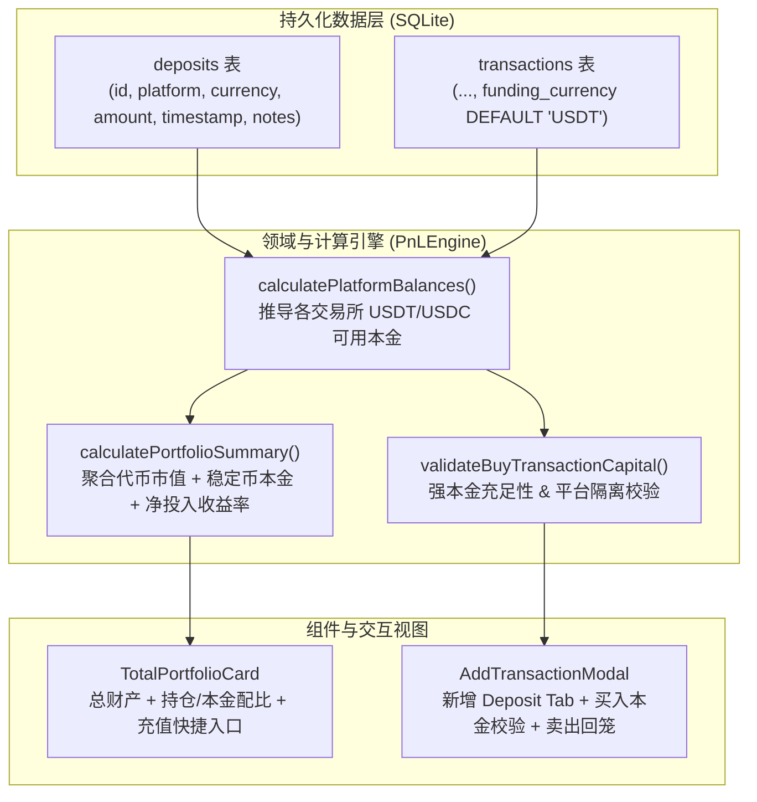

# 实施方案：多交易所聚合平台与充值本金核算系统 (Implementation Plan)

本项目方案基于最新修订的 [`document/PRD.md`](file:///Users/rick/src/investment-tracker/document/PRD.md)，对 Investment Tracker 进行角色定位升级与财产核算重构：将 App 从单纯的“买卖记账器”升级为**“多交易所聚合资管平台”**，引入**平台充值本金（USDT/USDC）**、**买入本金强校验**、**平台资金沙盒物理隔离**以及**卖出回款自动回笼沉淀**的完整资金流转闭环。

---

## 1. 用户审查点 (User Review Required)

> [!IMPORTANT]
> **核心财务逻辑与账户规则确认**：
> 1. **稳定币范围**：初期聚焦主流美元稳定币 **USDT** 与 **USDC**，对内按 1:1 USD 等值计价并支持法币汇率实时换算。
> 2. **充值数据存储方案**：采用独立的 SQLite `deposits` 表存储充值流水，并为 `transactions` 表安全添加 `funding_currency TEXT DEFAULT 'USDT'` 字段。此举避免对原有 `transactions` 的 `CHECK(type IN ('BUY', 'SELL'))` 约束进行破坏性表重建，向后完全兼容。
> 3. **全平台总财产新核算公式**：
>    $$\text{总财产} = \sum \text{各代币持仓实时市值} + \sum \text{各平台可用稳定币本金}$$
>    $$\text{累计投资净盈亏} = \text{总财产} - \sum \text{净充值总本金}$$
> 4. **买入拦截交互**：在买入表单中实时展示所选平台对应稳定币的可用本金，若 $\text{总金额} > \text{可用本金}$，即刻高亮红字警示并禁用提交，提供一键切换至「充值」Tab 预填平台的便捷跳转。

---

## 2. 详细技术实现方案 (Proposed Changes)

### 架构与数据流设计



---

### 第一阶段：数据存储与模型定义 (Database & Domain Models)

#### [MODIFY] [types.ts](file:///Users/rick/src/investment-tracker/src/domain/types.ts)
- 新增稳定币类型：`export type DepositCurrency = 'USDT' | 'USDC';`
- 新增 `Deposit` 接口定义：
  ```typescript
  export interface Deposit {
    id: string;
    platform: PlatformType;
    currency: DepositCurrency;
    amount: number;
    timestamp: number;
    notes?: string;
    createdAt: number;
  }
  ```
- 扩展 `Transaction` 接口：增加 `fundingCurrency?: DepositCurrency;` 字段（默认 `'USDT'`）。
- 扩展 `PortfolioSummary` 接口：
  - `platformBalances: Record<PlatformType, { usdt: number; usdc: number; totalUSD: number }>;`
  - `totalCashReservesUSD: number;`
  - `totalCryptoMarketValueUSD: number;`
  - `totalNetDepositsUSD: number;`
  - `totalPortfolioValueUSD: number;`
  - `totalNetProfitUSD: number;`
  - `totalNetProfitPercent: number;`

#### [MODIFY] [schema.ts](file:///Users/rick/src/investment-tracker/src/database/schema.ts)
- 新增 `CREATE_DEPOSITS_TABLE` 建表 SQL 及平台时间戳索引：
  ```sql
  CREATE TABLE IF NOT EXISTS deposits (
      id TEXT PRIMARY KEY,
      platform TEXT NOT NULL,
      currency TEXT NOT NULL CHECK(currency IN ('USDT', 'USDC')),
      amount REAL NOT NULL CHECK(amount > 0),
      timestamp INTEGER NOT NULL,
      notes TEXT,
      created_at INTEGER NOT NULL
  );
  CREATE INDEX IF NOT EXISTS idx_deposits_platform ON deposits(platform, timestamp DESC);
  ```
- 添加向后兼容的列迁移语句（若不存在则执行 `ALTER TABLE transactions ADD COLUMN funding_currency TEXT DEFAULT 'USDT';`）。

#### [NEW] [depositRepository.ts](file:///Users/rick/src/investment-tracker/src/database/repositories/depositRepository.ts)
- 实现强类型 `DepositRepository`，支持：
  - `insert(deposit: Deposit): Promise<void>`
  - `delete(id: string): Promise<boolean>`
  - `findAll(order?: 'ASC' | 'DESC'): Promise<Deposit[]>`
  - `findByPlatform(platform: PlatformType): Promise<Deposit[]>`
  - `deleteAll(): Promise<void>`

#### [MODIFY] [transactionRepository.ts](file:///Users/rick/src/investment-tracker/src/database/repositories/transactionRepository.ts)
- 将 `funding_currency` 加入 `mapRowToTransaction`、`insert` 与 `update` 的 SQL 语句中，并保持默认值 `'USDT'`。

---

### 第二阶段：核心财务计算引擎与校验逻辑 (PnL Engine)

#### [MODIFY] [pnlEngine.ts](file:///Users/rick/src/investment-tracker/src/domain/calculations/pnlEngine.ts)
1. **各交易所可用本金推导函数**：
   ```typescript
   public static calculatePlatformBalances(
     deposits: Deposit[],
     transactions: Transaction[]
   ): Record<PlatformType, { usdt: number; usdc: number; totalUSD: number }>
   ```
   - 遍历各平台 `deposits` 累加注入本金；
   - 遍历该平台 `transactions`：
     - 若 `BUY`：扣减对应的 `fundingCurrency`（`amount * price + fee`）；
     - 若 `SELL`：回款净额（`amount * price - fee`）增计回该平台的 `fundingCurrency`（默认 USDT）；
   - 严格保证各交易所独立计算，互不渗透。
2. **买入交易本金强校验函数**：
   ```typescript
   public static validateBuyCapital(
     platform: PlatformType,
     currency: DepositCurrency,
     cost: number,
     availableBalance: number
   ): { valid: boolean; error?: string; shortfall: number }
   ```
3. **全平台资产看板核算升级**：
   - 升级 `calculatePortfolioSummary`，接收 `holdings` 与 `deposits`、`transactions`；
   - 汇总计算：代币总市值 + 各平台稳定币可用本金 = 全平台总财产；
   - 累计净投入本金 = $\sum \text{Deposits}$；
   - 全周期投资净收益 = $\text{全平台总财产} - \text{累计净充值}$。

---

### 第三阶段：UI 交互与视图落地 (UI Components)

#### [MODIFY] [AddTransactionModal.tsx](file:///Users/rick/src/investment-tracker/src/components/transactions/AddTransactionModal.tsx)
1. **顶部导航分段切换**：
   - 支持 **买入 (Buy)** / **卖出 (Sell)** / **充值 (Deposit)** 三模式切换；
2. **充值模式 (Deposit Mode)**：
   - 选择目标平台（OKX、Binance、CoinGecko、Coinbase）；
   - 选择稳定币币种（`USDT` / `USDC`）；
   - 输入充值金额（必须 $>0$）；
   - 时间戳（默认当前，支持自定义日期）与备注输入框；
   - 提交调用 `depositRepo.insert()` 并触发刷新；
3. **买入模式下的本金约束**：
   - 选择支付币种（USDT / USDC）；
   - 动态展示当前交易所该币种的可用本金徽章（如：`当前 OKX 可用: $1,250.00 USDT`）；
   - 实时校验 `Total Cost <= Available Balance`；
   - 若本金不足，显示红色警示卡片及差额，禁用确认按钮，并提供「去充值」快捷胶囊按钮一键切换至 Deposit 且预选平台。

#### [MODIFY] [TotalPortfolioCard.tsx](file:///Users/rick/src/investment-tracker/src/components/portfolio/TotalPortfolioCard.tsx)
- 展示全平台总财产（代币市值 + 稳定币本金）；
- 卡片内部增加资产形态轻量标签：`代币市值 $XX,XXX (XX%) | 闲置本金 $X,XXX (X%)`；
- 右上角/操作区提供醒目的「+ 充值」与「+ 记一笔」快捷入口；
- 盈亏指示器支持展示绝对净投资收益（基于净充值本金核算）。

#### [MODIFY] [App.tsx](file:///Users/rick/src/investment-tracker/App.tsx)
- 实例化 `DepositRepository`；
- 状态中加入 `deposits` 列表与各平台实时余额推导；
- `reloadData` 中并行加载 `deposits`；
- 传递 `depositRepo` 与各平台余额至 `AddTransactionModal` 与 `TotalPortfolioCard`。

#### [MODIFY] [zh.ts](file:///Users/rick/src/investment-tracker/src/i18n/zh.ts) & [en.ts](file:///Users/rick/src/investment-tracker/src/i18n/en.ts)
- 增加多语言文案支持：
  - 充值、入金、目标平台、充值币种、可用本金、本金不足警示、一键充值、平台资金隔离说明、闲置资金储备等。

---

## 3. 验证计划 (Verification Plan)

### 自动化单元测试 (Automated Jest Tests)
运行 Jest 测试套件，确保新增功能与原有 14 个测试套件全部通过：
1. **新建 [depositRepository.test.ts](file:///Users/rick/src/investment-tracker/__tests__/depositRepository.test.ts)**：
   - 验证充值记录的创建、查询、按平台过滤、删除与级联清理。
2. **新建 [pnlEngineDeposits.test.ts](file:///Users/rick/src/investment-tracker/__tests__/pnlEngineDeposits.test.ts)**：
   - 验证各交易所独立本金计算：OKX 充值 1000 USDT，买入 600 USDT BTC，卖出 200 USDT BTC，推导可用本金为 600 USDT；
   - 验证平台资金隔离：Binance 本金为 0 时，OKX 有 1000 USDT，校验 Binance 买入时必须拦截并返回本金不足；
   - 验证全平台总财产公式：BTC 市值 $5,000 + OKX 闲置 600 USDT + Binance 闲置 200 USDC = $5,800。
3. **扩展 [addTransactionValidation.test.ts](file:///Users/rick/src/investment-tracker/__tests__/addTransactionValidation.test.ts)**：
   - 验证买入本金不足时的强校验与表单行为。
4. **运行全量测试**：
   ```bash
   npm test -- --passWithNoTests
   ```

### 手动交互验证 (Manual Verification)
1. 打开 App，在首页总资产卡片点击「+ 充值」；
2. 为 `OKX` 充值 1,000 USDT；
3. 验证首页总资产实时变为 `$1,000.00`，可用本金标签显示 `$1,000.00`；
4. 点击「+ 记一笔」，选 `OKX` 买入价值 800 USDT 的 BTC：
   - 表单显示 OKX 可用本金为 $1,000 USDT；
   - 点击提交成功，OKX 剩余本金更新为 200 USDT；
5. 再次点击「+ 记一笔」，选 `Binance` 尝试买入 BTC：
   - 表单提示 Binance 可用本金为 $0 USDT，显示红色警示并阻断提交；
   - 证明平台资金隔离生效；
6. 卖出 OKX 的 BTC，验证回款自动返还至 OKX USDT 本金池。
